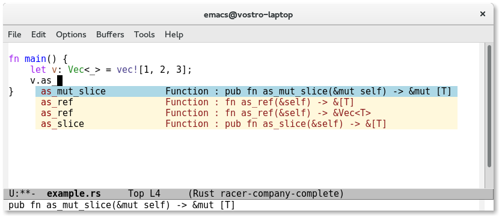
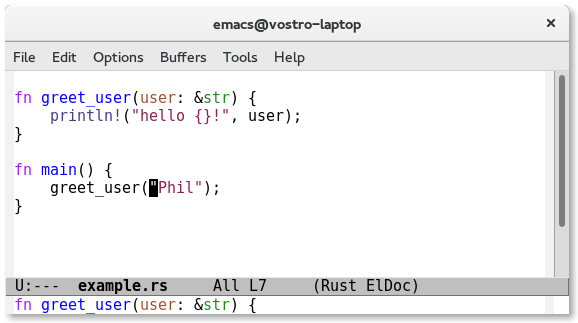

# *Racer* - code completion for [Rust](http://www.rust-lang.org/)

[](https://travis-ci.org/phildawes/racer)





*RACER* = *R*ust *A*uto-*C*omplete-*er*. A utility intended to provide rust code completion for editors and IDEs. Maybe one day the 'er' bit will be exploring + refactoring or something.

## Installation

1. Clone the repository: ```git clone https://github.com/phildawes/racer.git```

2. ```cd racer; cargo build --release```.  The binary will now be in ```./target/release/racer```

3. Fetch the rust sourcecode from git, or download from https://www.rust-lang.org/install.html

4. Set the ```RUST_SRC_PATH``` env variable to point to the 'src' dir in the rust source installation

   (e.g. ```% export RUST_SRC_PATH=/usr/local/src/rust/src``` )

5. Test on the command line:

   ```./target/release/racer complete std::io::B ```  (should show some completions)


## Emacs integration

Emacs intergation has been moved to a separate project: [emacs-racer](https://github.com/racer-rust/emacs-racer)

## Vim integration

Vim intergation has been moved to a separate project: [vim-racer](https://github.com/racer-rust/vim-racer)

## Kate integration

The Kate community maintains a [plugin](http://quickgit.kde.org/?p=kate.git&a=tree&&f=addons%2Frustcompletion). It will be bundled with future releases of Kate (read more [here](https://blogs.kde.org/2015/05/22/updates-kates-rust-plugin-syntax-highlighting-and-rust-source-mime-type)).

1. Enable 'Rust code completion' in the plugin list in the Kate config dialog

2. On the new 'Rust code completion' dialog page, make sure 'Racer command' and 'Rust source tree location' are set correctly
